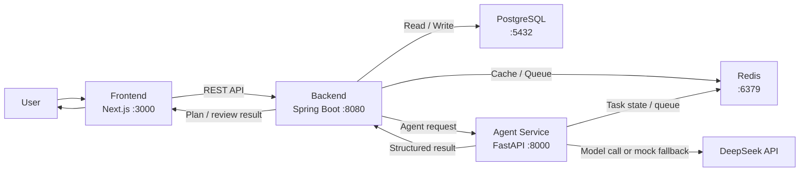

# Architecture

## 目标

本项目采用 monorepo 多服务架构，优先保证 MVP 闭环可以清晰演进：前端负责用户交互，Java 后端负责业务状态和 API 编排，Python Agent 服务负责 AI 分析与计划生成，PostgreSQL 和 Redis 提供基础依赖。

## 端口约定

| 服务 | 默认地址 | 端口 | 说明 |
| --- | --- | --- | --- |
| Frontend | `http://localhost:3000` | `3000` | Next.js 前端应用 |
| Backend | `http://localhost:8080` | `8080` | Spring Boot REST API |
| Agent Service | `http://localhost:8000` | `8000` | FastAPI Agent 服务 |
| PostgreSQL | `localhost:5432` | `5432` | 主业务数据库 |
| Redis | `localhost:6379` | `6379` | 缓存、队列和异步任务状态 |

## 环境变量约定

| 变量 | 用途 |
| --- | --- |
| `FRONTEND_PORT` | 前端本地端口 |
| `FRONTEND_BASE_URL` | 前端访问地址 |
| `NEXT_PUBLIC_API_BASE_URL` | 前端请求后端 API 的公开地址 |
| `BACKEND_PORT` | 后端本地端口 |
| `BACKEND_BASE_URL` | 后端服务地址 |
| `AGENT_SERVICE_PORT` | Agent 服务本地端口 |
| `AGENT_SERVICE_BASE_URL` | 后端调用 Agent 服务的地址 |
| `DEEPSEEK_API_KEY` | DeepSeek API Key；未配置时 Agent 服务使用 mock fallback |
| `DEEPSEEK_API_BASE_URL` | DeepSeek/OpenAI-compatible API Base URL |
| `PROFILE_ANALYZER_MODEL` | Profile Analyzer 使用的模型名，当前暂定 `deepseek-v4-pro` |
| `PROFILE_ANALYZER_TIMEOUT_SECONDS` | Profile Analyzer 模型请求超时时间 |
| `POSTGRES_HOST` | PostgreSQL 主机 |
| `POSTGRES_PORT` | PostgreSQL 端口 |
| `POSTGRES_DB` | PostgreSQL 数据库名 |
| `POSTGRES_USER` | PostgreSQL 用户名 |
| `POSTGRES_PASSWORD` | PostgreSQL 密码 |
| `DATABASE_URL` | 通用 PostgreSQL 连接串 |
| `SPRING_DATASOURCE_URL` | Spring Boot JDBC 连接串 |
| `SPRING_DATASOURCE_USERNAME` | Spring Boot 数据库用户名 |
| `SPRING_DATASOURCE_PASSWORD` | Spring Boot 数据库密码 |
| `REDIS_HOST` | Redis 主机 |
| `REDIS_PORT` | Redis 端口 |
| `REDIS_URL` | Redis 连接串 |
| `OPENAI_API_KEY` | OpenAI API Key 占位变量，当前 Profile Analyzer 不依赖该变量 |

## 服务边界

| 模块 | 边界 |
| --- | --- |
| Frontend | 只处理页面、表单、状态展示和用户交互，不直接访问数据库或 Agent 服务 |
| Backend | 业务系统入口，负责鉴权、数据持久化、任务编排、调用 Agent 服务和对外 REST API |
| Agent Service | AI 能力边界，负责调用模型、运行 Agent workflow、返回结构化分析结果 |
| PostgreSQL | 保存用户、目标、学习计划、每日任务、进度日志和 Agent 执行记录 |
| Redis | 支撑缓存、异步任务队列、任务状态和短期中间结果 |

## MVP 调用流程

## 主要业务链路

1. 用户在前端填写背景、技能、目标、每日可用时间和计划周期。
2. 前端调用后端创建目标，并通过同源 API Route 触发目标画像分析。
3. 后端保存请求记录，并调用 Agent Service 执行能力画像、目标拆解、技能差距分析和计划生成。
4. Agent Service 返回结构化结果，后端持久化到 PostgreSQL；Day 06 已落地 `skill_profiles` 和 `agent_runs`。
5. 前端从后端读取学习计划和每日任务。
6. 用户每天提交完成情况，后端记录进度。
7. 后端调用 Agent Service 复盘进度，并根据结果调整后续任务。

## Day 01 决策

- 端口固定为 `3000`、`8080`、`8000`、`5432`、`6379`。
- Backend 是业务数据的主入口，Frontend 不直接调用 Agent Service。
- PostgreSQL 保存长期业务状态，Redis 保存缓存和异步任务相关状态。
- `.env.example` 是本地开发环境变量命名的基准。
